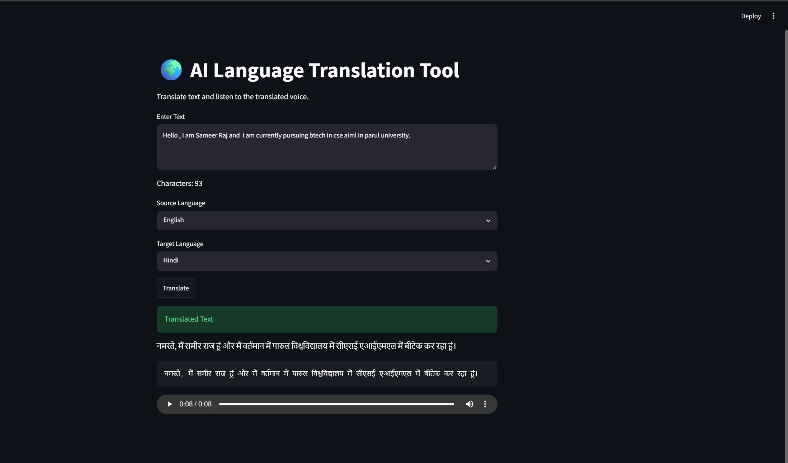

# AI Language Translation Tool

An AI-powered language translation application built using Python and Streamlit. This project allows users to translate text between multiple languages and listen to the translated output using text-to-speech technology.

## Features

* Multi-language translation
* Fast and accurate text translation
* Character counter
* Text-to-speech output
* Simple and user-friendly interface
* Real-time translation

## Technologies Used

* Python
* Streamlit
* Deep Translator
* gTTS (Google Text-to-Speech)

## Project Structure

```text
CodeAlpha_LanguageTranslationTool/
│
├── app.py
├── requirements.txt
├── README.md
└── screenshots/
    └── output.png
```

## Project Preview



## Installation

Navigate to the project directory:

```bash
cd CodeAlpha_LanguageTranslationTool
```

Install dependencies:

```bash
pip install -r requirements.txt
```

Run the application:

```bash
streamlit run app.py
```

## How It Works

1. Enter text in the input field.
2. Select the source language.
3. Select the target language.
4. Click the Translate button.
5. View the translated text.
6. Listen to the translated output using the audio player.

## Future Improvements

* Voice input support
* Automatic language detection
* Translation history
* Additional language support
* Improved user interface

## Internship Project

This project was developed as part of the CodeAlpha Artificial Intelligence Internship Program.
